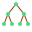

# 🌳 Decision Tree



Decision trees split data into regions based on feature values, forming a tree where each leaf gives a prediction.

## Mathematics

For classification, splits are chosen to maximize **information gain**. Using Gini impurity:

$$
G = \sum_{k=1}^K p_k (1 - p_k),
$$

where $p_k$ is the proportion of class $k$ in a node.

## Example (scikit-learn)

```python
from sklearn.datasets import load_iris
from sklearn.tree import DecisionTreeClassifier

X, y = load_iris(return_X_y=True)
model = DecisionTreeClassifier(max_depth=3)
model.fit(X, y)
```

## Use Case Example

Predicting customer churn based on usage statistics.

## Recommendations

- Easy to interpret; visualize the tree for insights.
- Prone to overfitting; limit depth or prune.
- See the [scikit-learn guide](https://scikit-learn.org/stable/modules/tree.html#classification) for more.
