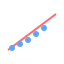

# 📈 Linear Regression



Linear regression models the relationship between a dependent variable $y$ and one or more features $x_1, \dots, x_n$ by fitting a linear function.

## Hypothesis

For an input vector $\mathbf{x} = [1, x_1, \dots, x_n]^T$, the model predicts

$$
\hat{y} = \mathbf{x}^T \boldsymbol{\theta} = \theta_0 + \theta_1 x_1 + \cdots + \theta_n x_n.
$$

## Loss Function

Parameters $\boldsymbol{\theta}$ are learned by minimizing the **mean squared error** (MSE):

$$
J(\boldsymbol{\theta}) = \frac{1}{m} \sum_{i=1}^{m} (\hat{y}^{(i)} - y^{(i)})^2.
$$

## Example (scikit-learn)

```python
import numpy as np
from sklearn.linear_model import LinearRegression

# toy dataset
X = np.array([[1], [2], [3], [4]])
y = np.array([2, 3, 3, 5])

model = LinearRegression()
model.fit(X, y)

pred = model.predict([[5]])
print(pred)
```

## Use Case Example

Predicting house prices from features like square footage and number of rooms.

## Recommendations

- Works well when the relationship between features and target is roughly linear.
- Sensitive to outliers; consider preprocessing or robust regression if needed.
- See the [scikit-learn guide](https://scikit-learn.org/stable/modules/linear_model.html#ordinary-least-squares) for more details.

## Interpretation

- Coefficients $\theta_j$ show how much the prediction changes per unit increase in feature $x_j$.
- The model is fast and interpretable but assumes a linear relationship between features and target.
