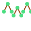

# 🌲 Random Forest



Random forests build many decision trees on bootstrapped datasets and average their predictions.

## Mathematics

For regression, the forest prediction is the average of individual tree outputs:

$$
\hat{y} = \frac{1}{T} \sum_{t=1}^T f_t(x).
$$

## Example (scikit-learn)

```python
from sklearn.datasets import load_diabetes
from sklearn.ensemble import RandomForestRegressor

X, y = load_diabetes(return_X_y=True)
model = RandomForestRegressor(n_estimators=100)
model.fit(X, y)
```

## Use Case Example

Forecasting house prices with diverse feature sets.

## Recommendations

- Handles nonlinearity and feature interactions well.
- Use more trees for stability but watch computation time.
- See the [scikit-learn guide](https://scikit-learn.org/stable/modules/ensemble.html#forest) for more.
